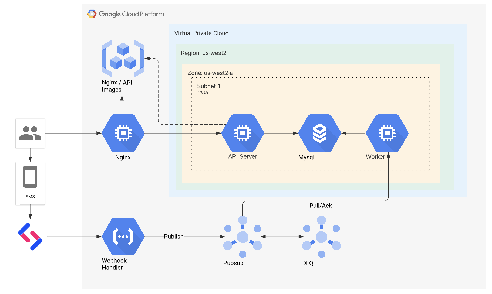

# Nickleback Facts
## A robust service for all of your favorite Nickleback facts

#### Live site: https://nbfacts.com/

## Architecture
1. Golang API - Dockerized container running on GCP Compute VMs
2. Golang Worker - Dockerized container running on GCP Compute VMs 
3. Nginx - Acts as a reverse proxy to Golang API / hosts Nuxt Frontend and Swagger
4. MySQL - Hosted as an instance on GCP SQL
5. Vue/Nuxt - Frontend application that displays the latest facts
6. PubSub - Broker between incoming sms webhook and application
7. Function - serverless function that takes incoming webhook sms events and publishes to topic

View the API here: https://nbfacts.com/api/v1/swagger/index.html

Future considerations:
1. Implement further frontend functionality 
2. Authentication
3. Unit/integration tests
4. Kubernetes instead of simple VMs

